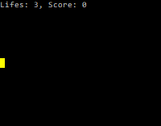

Практика №1
===========

**Задание 1)** Запросите у пользователя два целых числа, затем выведите их сумму

Пример:
```
Введите числа:
> 4
> 5
Сумма: 9
```

-------

**Задание 2)** Запросите у пользователя множество чисел. Как только пользователь введет `0`, выведите сумму чисел

Пример:
```
Введите числа:
> 4
> 5
> 7
> 2
> 0
Сумма: 18
```

-------
**Задание 2+)** Запросите у пользователя множество чисел в виде одной строки (числа разделены пробелом). После это выведите сумму чисел

Пример:
```
Введите числа:
> 4 1 4 5 1 2 7
Сумма: 24
```


-------

**Задание 3)** Запросите у пользователя два вещественных числа, а затем математический оператор (`+`, `-`, `/` или `*`). Выполните соответсвующую операцию и выведите резульат

Пример:
```
Введите число A:
> 4.2
Введите число B:
> 3
Введеите операцию:
> -
Результат A-B:
> 1.2
```

При отображении результата вставьте введеный оператор между `A` и `B`

-------

**Задание 3+)** Пользователь вводит математическое выражение вида `<число> <оператор> <число>`. Числа - вещественные. Оператор - один из: `+`, `-`, `/` и `*`. Вывести результат выражения

Пример:
```
Введите мат. выражение
> 4.2 * 2
Результат:
> 8.4
```

-----------

**Задание 4)** Необходимо разработать консольный однопиксельный Paint. Есть холст размером 10x10. Перемещение по холсту осуществлется клавишами стрелок на клавиатуре. Нужно предусмотреть, чтобы курсор не выходил за границы холста. При нажатиии на пробел, ячейка, под которую попадает курсор, должна загореться красным цветом (сохранять это состояние не требуется)

Пример:


-----------

**Задание 4+)** Необходимо разработать консольную игру "Золотая лихорадка". 
На поле в случайном месте повляется золотой слиток (в виде желтой ячейки). Задача - добраться курсором до него и нажать "Пробел". Управление осуществляется стрелками на клавиатуре. После нажатия на любую кнопку, золотой слиток становится невидимым. 

Если игрок нажимает "Пробел" там, где слитка нет, то ячейка подсвечиваетя красным и счетчик жизней уменьшается на 1

Еслм игрок нажимает "Пробел" там, где слиток есть, то ячейка подсвечиваетя зеленым, игроку добавляется 1 очко и золотой слиток перемещается на новое случайное место (аналогично, отображается толко на один ход, потом становится невидимым)

Игра заканчивается, когда счетчик жизней достигает нуля. В этом случае нужно вывести надпись "Game over"

Размер игрового поля: 10x10

Для генерации случайной позиции используйте класс `Random`:

```
Random rand = new Random();
int gold_pos_x = rand.Next(10);
int gold_pos_y = rand.Next(10);
```

Пример:



