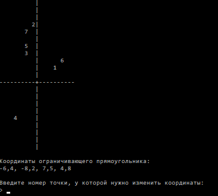

Практика №2
===========

**Задание 1)** Запросите у пользователя набор целых чисел. Как только пользователь введет вместо очередного числа пустую строку, отобразите уникальное множество введенных чисел.

При выполнении задания используйте класс `HashSet<T>`

Пример:
```
Введите числа:
> 4
> 1
> 5
> 1
> 15
> 2
> 5
>
Уникальные числа:
4 1 5 15 2
```

-------


**Задание 2)** Попросите пользователя ввести строку текста. Посчитайте кол-во уполтреблений каждой из букв (исключите пробелы и знаки препинания `,`, `.`, `:`, `-`, `;`, `'`, `"`) и выведите ту букву, которая употреблялась чаще всего, а так же число ее повторений. Предусмотрите, что одна и та же буква может быть как заглавной, так и строчной.

При выполнении задания используйте класс `Dictionary<K, V>`

Пример:
```
Введите строку текста:
> All the world’s a stage, And all the men and women merely players; They have their exits and their entrances; And one man in his time plays many parts. BY WILLIAM SHAKESPEARE
Самая частоупотребляемая буква:
E - 20
```

-------

**Задание 2+)** Доработайте задание 2 и выведите не одну, а 5 самых употребляемых букв (с их количеством) в порядке уменьшения частоты использования

Пример:
```
Введите строку текста:
> All the world’s a stage, And all the men and women merely players; They have their exits and their entrances; And one man in his time plays many parts. BY WILLIAM SHAKESPEARE
Самые частоупотребляемые буквы:
E - 20
A - 18
N - 12
L - 10
S - 10
T - 10
```

-------

**Задание 3)** Создайте структуру данных, которая содержит информацию о прямоугольнике (координаты X, Y, ширина и высота - целые числа). 

Пользователь будет вводить данные о множестве пересекающихся прямоугольников. Ввод заканчиввается, когда одна из сторон очередного введенного прямоугольника будет равна 0. Ваша задача определить площадь пересечения всех введенных прямоугольников

Разделите код программы на следующие функции:

- функция ввода информации о прямоугольнике
- функция определения пересечения двух прямоугольников
- функция расчета площади прямоугольника

Координаты пересечения двух прямоугольников A и B можно рассчитать след. образом: 
```
Ix0 = max(Ax0, Bx0)
Iy0 = max(Ay0, By0)
Ix1 = min(Ax1, Bx1)
Iy1 = min(Ay1, By1)
```
Где (`Ax0`, `Ay0`), (`Bx0`, `By0`) - координаты левой верхней точки соответствующих прямоугольников, (`Ax1`, `Ay1`), (`Bx1`, `By1`) - координаты правой нижней точки соответствующих прямоугольников

Пример:
```
Введите информацию о прямоугольниках:

Прямоугольник №1
X:> 0
Y:> 0
W:> 10
H:> 10

Прямоугольник №2
X:> 4
Y:> 3
W:> 8
H:> 5

Прямоугольник №3
X:> 2
Y:> 5
W:> 3
H:> 10


Прямоугольник №4
X:> 0
Y:> 0
W:> 0
H:> 0

Площадь пересечения: 3
```

-------


**Задание 3+)** Создайте структуру данных, которая содержит информацию о круге (координаты центра X, Y и радиус - вещественные числа). 

Пользователь будет вводить информацию о множестве кругов. После ввода очередного круга, проверьте не пересекается ли он с любым другим ранее введенным. Если не пересекается, то сохраните его в оперативной памяти. Если же пересекается, то выведите сообщение `"ОШИБКА: обнаружено пересечение с кругом №__"` (подставьте номер сохраненного круга, с которым было пересечение) и отбросьте его. Ввод кругов продолжается, пока пользователь не введет значение 0 в поле "Радиус" у круга. 

После завершения ввода выведите число сохраненных кругов (т.е. тех, которые не переекаются друг с другом)

Для сохранения информации о кругах используйте класс `List<T>`

Для того, чтобы проверить, что два круга пересекаются, используйте формулу расстояния между двумя центрами кругов. Если расстояние меньше суммы их радиусов, то круги пересекаютися

Пример:
```
Введите информацю о кругах:

Круг №1
X:> 0
Y:> 0
R:> 10

Круг №2
X:> 10
Y:> 10
R:> 4

Круг №3
X:> 12
Y:> 8
R:> 10
ОШИБКА: обнаружено пересечение с кругом №2
X:> 20
Y:> 8
R:> 10

Круг №4
X:> 0
Y:> 0
R:> 0

Сохранено кругов: 3
```


-------

**Задание 4)** Создайте класс, который содержит информацию о точках (координаты X, Y - вещественные числа), а так же метод, сдвигающий точку на случайную позицию в пределах от -10 до 10 (по обеим координатам)

Запросите у пользователя кол-во точек, которые нужно создать и создайте соответсвующее их количество и поместите их в список (`List<T>`). Воспользуйтеся методом сдвига точки на случайную позицию для установки начальных координат точек

После создания точек выведите координаты ограничивающего точки прямоугольника (т.е минимальные и максимальные координаты точек по осям X и Y)

Затем запросите номер точки (нумерация с 1), у которой требуется поменять координаты. Воспользуйтесь методом сдвига на случайную позицию для этой точки, а затем выведите новые координаты ограничивающего прямоугольника. Повторяйте этот процесс, пока пользователь не введет номер 0

Пример:
```
Введите количество точек:
> 5

Координаты ограничивающего прямоугольника:
-2.3, -3, 2, 5.3

Введите номер точки, у которой нужно изменить координаты:
> 3

Координаты ограничивающего прямоугольника:
-2.3, -4.4, 2, 5.3

Введите номер точки, у которой нужно изменить координаты:
> 2

Координаты ограничивающего прямоугольника:
-2.3, -4.4, 2, 5.3

Введите номер точки, у которой нужно изменить координаты:
> 0
```

-------

**Задание 4+)** Визуализируйте задачу 4, отобразив в консоли положение точек. Для этого:
- ограничьте макс. кол-во точек 9-ью штуками
- при выводе сдвиньте начало координат на 10 вправо и вниз,
- отобразите ось координат, как в примере
- при выводе округляйте координаты точек к ближайшему целому числу

Пример:


