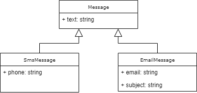
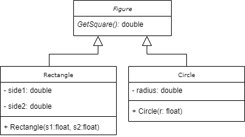

Практика №3
===========

**Задание 1)** Предыстория: вы разрабатываете программу для агрегации сообщений из разных источников, в которой понадобилось реализовать функцию поиска

1.1) Создайте классы согласно диаграмме классов:



Класс `Message` содержит публичное поле `text` типа `string`.

Класс `Message` базовый для двух других классов: `SmsMessage` и `EmailMessage`, которые содержат дополнительные поля

1.2) Разработайте метод `static bool Search(Message message, string query)`, который возращает `true`, если в переданном сообщении `message.text` содержится подстрока `query`. Для реализации вы можете использовать стандартный метод [Contains](https://docs.microsoft.com/ru-ru/dotnet/api/system.string.contains) у строки

1.3) В основной программе:
  - создайте список `List<Message> messages`
  - программно заполнителе его 3-мя экземплярами `SmsMessage` и 3-мя экземплярами `EmailMessage`
  - попросите пользователя ввести строку для поиска `query`
  - посчитайте и выыедите кол-во сообщений, в которых присутсвует подстрока `query`, используя метод `static bool Search(Message message, string query)`
  

-------

**Задание 2)** Доработайте программу из задания №1 так, чтобы поиск велся по всем полям классов. Для этого создайте в классе `Message` *виртуальный* (`virtual`) метод `bool Search(string query)`, который должен будет переопределен в классах-наследниках `SmsMessage` и `EmailMessage`. Данный метод должен вывести `true`, если искомая подстрока найдена хотя бы в одном из полей текущего класса

Программа по-прежнему должна выводить кол-во сообщений, попавших под фильтр.

-------

**Задание 2+)** Доработайте программу из задания №2 так, чтобы она возращала не только кол-во сообщений, удовлетворяющих поиску, но и сами сообщения. В зависимости от конкретного класса, сообщения должны выводиться по-разному. Для этого переопределите стандартный метод `string ToString()` у классов `SmsMessage` и `EmailMessage`

Шаблон для смс-сообщения: `SMS [phone]: [text]`

Шаблон для email-сообщения: `From <[email]> "[subject]": [text (если длина > 25, то обрезать, добавив многоточие)]`

Пример:
```
SMS +8(999)111-22-33: Hello!
From <test@example.com> "You are winner!": Hi! Congratulations! You ...
```

-------

**Задание 3)** Создайте программу, в которую пользователь вносит данные о различных фигурах (прямоугольниках и кругах) и которая печатает площадь всех введенных фигур. Для этого:

3.1) Создайте классы по следующей диаграмме:



Метод `GetSquare` в классе `Figure` - *абстрактный* (`abstract`), как и сам класс `Figure`. Классы `Rectangle` и `Circle` реализуют свои собственные версии `GetSquare` - см. формулы площади [прямоугольника](http://letmegooglethat.com/?q=%D1%84%D0%BE%D1%80%D0%BC%D1%83%D0%BB%D0%B0+%D0%BF%D0%BB%D0%BE%D1%89%D0%B0%D0%B4%D0%B8+%D0%BA%D1%80%D1%83%D0%B3%D0%B0) и [круга](http://letmegooglethat.com/?q=%D1%84%D0%BE%D1%80%D0%BC%D1%83%D0%BB%D0%B0+%D0%BF%D0%BB%D0%BE%D1%89%D0%B0%D0%B4%D0%B8+%D0%BA%D1%80%D1%83%D0%B3%D0%B0)

Все поля классов `Rectangle` и `Circle` *приватные* (`private`) и задаются с помощью соответвующих *конструкторов* (`Rectange(float s1, float s2)`, `Circle(float r)`)

3.2) В основной программе запросите ввод данных о фигурах. Поскольку поля у классов разные, сначала запросите тип, потом уже данные конкретного класса. Если введена пустая строка в качестве типа, то ввод завершается

3.3) Вызовите метод `GetSquare` для получения площади одной фигуры. Просуммируйте значения площади у всех фигур

Пример:

```
Введите тип: 
> circle
Радиус: 
> 10


Введите тип: 
> rectangle
Сторона 1: 
> 5.2
Сторона 2: 
> 3

Введите тип: 
> 

Площадь всех фигур: 329.7592
```

-------

**Задание 3+)** Переделайте в программе из задания №3 метод `GetSquare` в публичное *свойство* `Square`

-------

**Задание 4)** Кажется, кто-то оставил здесь решение четвертой задачи:

```
using System;

namespace Task3_4
{
    interface INumberProvider
    {
        bool IsFinished();
        float GetNumber();
    }
    
    class Program
    {
        static float CalculateSum(INumberProvider numberProvider)
        {
            float res = 0;
            while (!numberProvider.IsFinished())
            {
                res += numberProvider.GetNumber();
            }
            return res;
        }

        static void Main(string[] args)
        {
            float sum = CalculateSum(new ConsoleNumberProvider());
            Console.WriteLine("Сумма чисел: {0}", sum);
            Console.ReadLine();
        }
    }
}
```

Но забыл вставить реализацию класса `ConsoleNumberProvider`. Вам придется восполнить этот недостаток. 

Не меняя класс `Program`, вы должны объявить класс `ConsoleNumberProvider`, который реализует интерфейс `INumberProvider`. Задача этого класса - запросить ввод чисел у пользователя. Как только пользователь введет число 0, ввод должен завершиться. 

Интерфейс `INumberProvider`:
  - Метод `GetNumber` - возвращает очередное введенное число
  - Метод `IsFinished` - возвращает `true`, если ввод закончен
  
Пример:
```
> 5
> 3.5
> -2
> 0
Сумма чисел: 6.5
```

-------

**Задание 4+)** Реализуйте второй вариант `INumberProvider`, который извлекает числа не из консоли, а из массива чисел. Назовите этот класс `ArrayNumberProvider`. Он должен принимать в конструкторе массив типа `float` и поочередно извлекать из него элементы. Измените код метода `Main` в класс `Program` на следующий:

```
static void Main(string[] args)
{
    float[] arr = { 5, 3.5f, -2 };
    float sum = CalculateSum(new ArrayNumberProvider(arr));
    Console.WriteLine("Сумма чисел: {0}", sum);
    Console.ReadLine();
}
```
