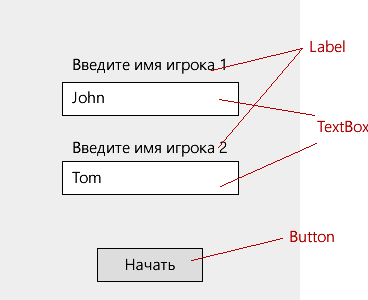
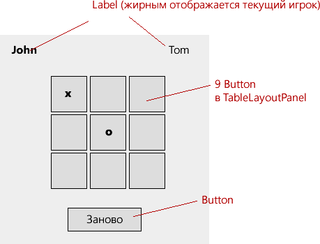

Практика №4
===========

Ваша задача - разработать оконную программу "Крестики-нолики"

**1)** Создайте проект Windows Forms и в нем две формы:

Форма ввода имени игроков:



Форма игрового поля



Кнопка "Заново" изначально должна быть выключена (свойство Enabled = false)

**2)** Реализуйте открытие второй формы при нажатии на "Начать"

После начала игры вам нужно открыть вторую форму, передать в нее данные об именах игроков и закрыть первую. 

Для передачи имен создайте соответвующие свойства в классе второй формы

Поскольку по умолчанию первая открытая форма является основной, ее закрытие приводит к закрытию приложения. Чтобы предотвратить это, измените класс `Program` следующим образом:

```
    static class Program
    {
        public static ApplicationContext Context;

        /// <summary>
        /// Главная точка входа для приложения.
        /// </summary>
        [STAThread]
        static void Main()
        {
            Application.EnableVisualStyles();
            Application.SetCompatibleTextRenderingDefault(false);
            Context = new ApplicationContext(new Form1()); // Form1 - название класса вашей первой формы
            Application.Run(Context);
        }
    }

```

Тогда вы будете открывать вторую форму след. образом:

```
  var newForm = new Form2();          // Создаем новую форму. Form2 - название класса вашей второй формы
  newForm.playerName1 = "...";        // playerName1 - строковое свойство для хранения имени первого игрока
  newForm.playerName2 = "...";        // playerName2 - строковое свойство для хранения имени второго игрока
  newForm.Show();                     // Отображаем вторую форму
  Program.Context.MainForm = newForm; // Делаем вторую форму основной
  Close();                            // Закрываем первую форму
```

**3)** Подставьте имена игроков в соответвующие метки на второй форме

Это можно сделать в методе `Load` у второй формы

**4)** Реализуйте логику игры "Крестики нолики" во второй форме

Жирным шрифтом должно обозначаться, какой игрок сейчас ходит

При нажатии на пустую кнопку на поле ее текст должен поменяться на `O` или `X` в зависимости от того, какой игрок ходит. 

Как только какой-нибудь игрок выиграет, выведите сообщение `Игрок {{NAME}} выиграл!` и разблокируйте кнопку "Заново"

**5)** При нажатии на кнопку "Заново", поменяйте местами игроков на поле и очистите поле 
